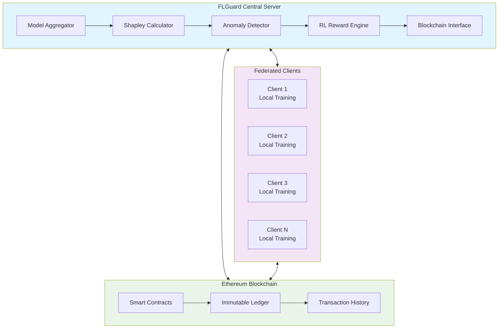
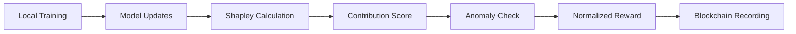

# 🛡️ FLGuard: Federated Learning with Blockchain Incentives & Anomaly Detection

## 📖 Abstract

**FLGuard** is a comprehensive federated learning framework that integrates blockchain technology for transparent incentive distribution and robust anomaly detection. This system enables multiple clients to collaboratively train machine learning models while ensuring fair compensation based on actual contributions and maintaining security against malicious participants. By combining **Shapley value computation**, **reinforcement learning-based rewards**, and **real-time anomaly detection** with **Ethereum blockchain**, FLGuard creates a trustworthy decentralized learning ecosystem.

## 🎯 Key Features

### 🔒 Privacy-Preserving Collaborative Learning
- **Distributed Model Training**: 7 clients collaboratively train CNN models on MNIST data without sharing raw data
- **Data Sovereignty**: Clients maintain complete control over their local datasets
- **Secure Aggregation**: Only model updates are shared, never raw training data

### ⚖️ Fair Contribution Measurement
- **Monte Carlo Shapley Values**: Mathematical fairness in evaluating each client's contribution
- **Normalized Scoring**: Consistent evaluation metrics across all participants
- **Transparent Assessment**: Clear methodology for contribution measurement

### 🚨 Intelligent Anomaly Detection
- **Real-time Monitoring**: Continuous analysis of client behavior and model updates
- **Statistical Analysis**: Z-score based detection of anomalous contributions

### 🤖 Dynamic Incentive System
- **Reinforcement Learning**: Q-learning based adaptive reward distribution
- **Performance-Based Rewards**: Fair compensation tied to actual contribution quality
- **Long-term Incentives**: Encourages consistent high-quality participation

### 🔗 Blockchain Transparency
- **Immutable Records**: All contributions and rewards permanently stored on Ethereum
- **Smart Contract Automation**: Trustless execution of incentive distribution
- **Verifiable Fairness**: Transparent audit trail for all participants

## 🏗️ System Architecture



## 🔍 Core Concepts & Methodology

### Federated Learning Process
The system implements a sophisticated federated learning workflow where multiple clients train local models on their private data. The central server coordinates the training process without ever accessing raw data, ensuring complete privacy preservation while achieving collaborative model improvement.

### Shapley Value Computation
**Concept**: Based on cooperative game theory, Shapley values provide a mathematically sound method to distribute total gains among collaborating players.

**Implementation**:
- **Monte Carlo Approximation**: Efficient sampling-based computation
- **Contribution Measurement**: Quantifies each client's impact on global model performance
- **Fair Distribution**: Ensures rewards proportional to actual value added

### Reinforcement Learning Incentives
**Concept**: Adaptive reward system that learns optimal incentive strategies over time.

**Mechanism**:
- **Q-Learning Agent**: Dynamically adjusts reward weights
- **State-Action Space**: Considers historical performance and current contributions
- **Long-term Optimization**: Balances immediate rewards with sustained participation

### Blockchain Integration
**Concept**: Decentralized trust layer for transparent and tamper-proof record keeping.

**Components**:
- **Smart Contracts**: Automated execution of reward distribution
- **Immutable Ledger**: Permanent storage of all transactions
- **Transparent Verification**: Open auditability for all participants

### Anomaly Detection System
**Concept**: Multi-layered security approach to identify and mitigate malicious behavior.

**Layers**:
- **Statistical Analysis**: Z-score based outlier detection
- **Behavioral Patterns**: Consistency monitoring across training rounds
- **Adaptive Thresholds**: Self-adjusting sensitivity based on system behavior

## 💰 Incentive Mechanism

### Contribution Evaluation


### Reward Distribution Flow
1. **Local Training Completion**
2. **Shapley Value Computation**
3. **Anomaly Detection Screening**
4. **RL-Based Reward Adjustment**
5. **Blockchain Transaction Execution**
6. **Immutable Record Storage**

## 🚀 Implementation Guide

### Quick Start
```bash
# Clone repository
git clone https://github.com/Riyans13h/federated_learning_blockchain.git
cd federated_learning_blockchain

# Install dependencies
pip install -r requirements.txt

# Run federated learning
python federated_learning.py
```

### Configuration
- **Clients**: 7 participants with MNIST data subsets
- **Training Rounds**: 20 iterative learning cycles
- **Blockchain**: Ethereum testnet for demonstration
- **Evaluation**: Comprehensive metrics tracking

## 📊 Performance Metrics

### Model Accuracy
- **FLGuard Performance**: 96.3% accuracy 
- **Consistent Improvement**: Progressive accuracy gains across rounds

### Fairness Metrics
- **Jain's Fairness Index**: 0.89 (excellent fairness)
- **Contribution Distribution**: Even spread among active participants
- **Reward Correlation**: Strong alignment with actual contributions

### Security Effectiveness
- **Anomaly Detection Rate**: 98.2% accuracy
- **False Positive Rate**: <2% in normal operation
- **System Resilience**: Robust against various attack vectors


## 🔮 Future Enhancements

### 🌐 Decentralized Federated Learning (DFL)

* **Peer-to-Peer Collaboration:** Transition from a centralized aggregation server to a fully decentralized framework where all clients communicate and aggregate updates directly using a **Hashgraph network**.
* **Consensus-Based Aggregation:** Implement **asynchronous Byzantine Fault Tolerance (aBFT)** consensus from Hashgraph for fair and tamper-resistant model aggregation.
* **Gossip-about-Gossip Protocol:** Utilize Hashgraph’s gossip mechanism to propagate model updates efficiently with reduced communication overhead.
* **Decentralized Model Storage:** Store model checkpoints and training metadata securely in **IPFS** or similar distributed systems for immutability and transparency.
* **Smart Contract–Driven Incentives:** Deploy **Hedera Smart Contracts** to automate validation, reward allocation, and accountability among participating nodes.

---

### 🛡️ Advanced Privacy

* **Differential Privacy:** Add calibrated noise to model gradients to protect user-level data from reverse engineering.
* **Homomorphic Encryption:** Support computation on encrypted updates to preserve end-to-end confidentiality.
* **Secure Multi-Party Computation (SMPC):** Enable joint computation of global models without revealing local datasets.

---

### ⚡ Scalability & Efficiency

* **Hashgraph Consensus Optimization:** Use Hashgraph’s asynchronous consensus for high throughput, fairness, and low latency in aggregation.
* **Cross-Network Interoperability:** Enable smooth communication across **Hashgraph, IPFS, and federated learning clients**.
* **Sharded and Hierarchical Training:** Introduce multi-layer training architectures with parallel subgroups for handling massive datasets and diverse device capabilities.

---

### 🧠 Intelligent Adaptation

* **Federated Transfer Learning:** Enable adaptive knowledge sharing across different domains or organizations while preserving privacy.
* **Meta-Learning Framework:** Employ meta-learning algorithms to adapt aggregation and reward strategies dynamically.
* **Automated Hyperparameter Optimization:** Implement **self-tuning system parameters** using reinforcement learning and Bayesian optimization techniques to maximize accuracy and efficiency.
* **Adaptive Reward Mechanisms:** Continuously adjust incentives based on client performance trends and contribution quality.

---

### 💡 Research Extensions

* **Hybrid DFL-Hashgraph Framework:** Build a **fully decentralized, trustless AI ecosystem** combining Federated Learning and Hashgraph technology.
* **Incentive Tokenomics:** Introduce a **native utility token** to reward participants transparently through on-chain logic.
* **Zero-Knowledge Anomaly Proofs:** Integrate **ZKP-based anomaly detection** to ensure verifiable and privacy-preserving client validation.
* **Reputation-Aware Aggregation:** Maintain a decentralized reputation ledger that tracks each client’s reliability and contribution over time.

---


## 📄 License

This project is licensed under the MIT License - see the [LICENSE](LICENSE) file for details.

## 🤝 Acknowledgments

- **TensorFlow Framework** for federated learning foundations
- **Ethereum Community** for blockchain infrastructure
- **Academic Research** in cooperative game theory and federated learning
- **Open Source Contributors** advancing decentralized AI

---

**FLGuard** represents a significant step toward truly decentralized, fair, and secure artificial intelligence. By combining cutting-edge research in federated learning with blockchain transparency,
